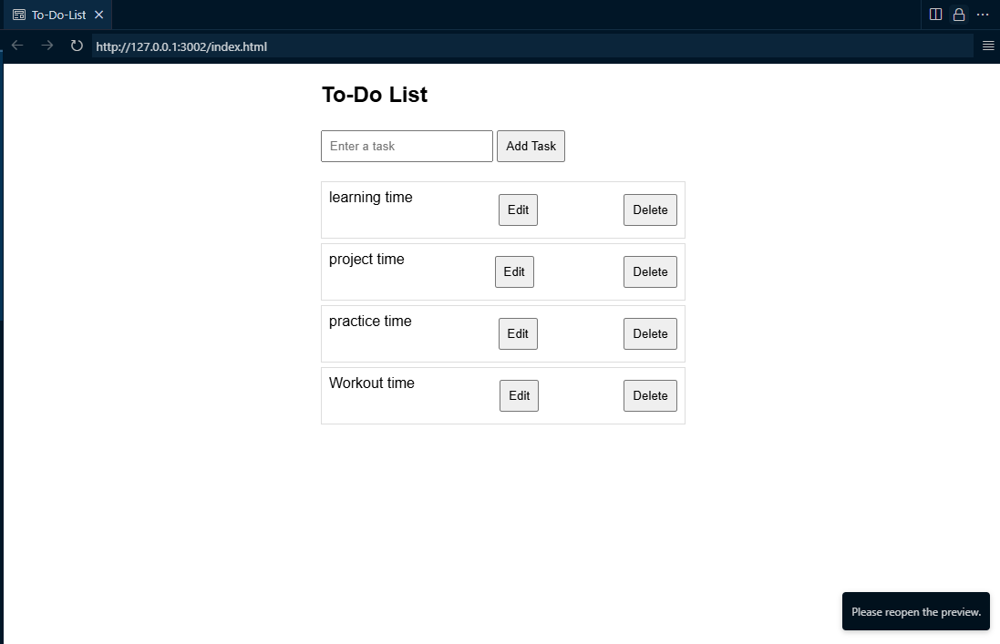

# To-Do List App

A simple to-do list web app built using HTML, CSS, and JavaScript.  
You can add, edit, and delete tasks. Tasks are saved in localStorage.

## Features
- Add tasks
- Edit tasks
- Delete tasks
- Data persistence using localStorage

## Preview

## Run Locally
Just open `index.html` in any browser.

---

Made with ❤️ using vanilla JavaScript.
